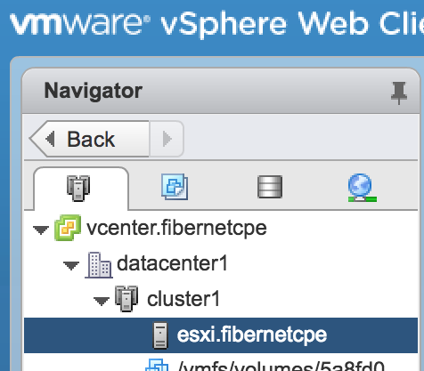

# Setup of VMWare vSphere

## Enable SSH on ESXi host

To be able to SSH into the host, in the vSphere Client GUI, select the host (esxi.fibernetcpe), then Configure/System/Services/SSH and set Edit Startup Policy to Start and stop with host.

Then SSH into the host, and run

    [root@esxi:~] esxcli system settings advanced set -o /Net/GuestIPHack -i 1

(Or use the GUI: Host/Manage/System/AdvancedSettings set _GuestIPHack_ set to 1. This vaule _will_ be kept after reboot.)

To avoid the username/password access, SSH into the host and add your public SSH key to `/etc/ssh/keys-root/authorized_keys`.

## Opening ports for VNC on ESXi host

The firewall on the ESXi host will by default filter out the VNC range TCP 5900-5911 that Packer uses. You can see what is enabled by SSHing into the host and [run](https://docs.vmware.com/en/VMware-vSphere/6.5/com.vmware.vsphere.security.doc/GUID-7A8BEFC8-BF86-49B5-AE2D-E400AAD81BA3.html)

    $ esxcli network firewall ruleset list

To see the actual port ranges, run

    $ esxcli network firewall ruleset rule list

Make sure the services _CIMHttpServer_ & _CIMHttpsServer_ are enabled because they make the firewall open ports 5988 & 5989.

    esxcli network firewall ruleset set --enabled=true --ruleset-id=CIMHttpServer
    esxcli network firewall ruleset set --enabled=true --ruleset-id=CIMHttpsServer

(Alternatively, see https://nickcharlton.net/posts/using-packer-esxi-6.html)

## Create datacenter and cluster on vCenter

The vSphere Terraform plugin cannot yet create a cluster in a datacenter, so you have to create a cluster manually.

Through the Web GUI (Flash) on vCenter, create `datacenter1` by right-clicking on the vCenter tree in the left pane, then right-click on the datacenter to create `cluster1`, right-click on the cluster to add a host, and there user `esxi.fibernetcpe`. Now tree should look like

From there on, Terrafom can (almost) control the rest. After terraform apply has created the datastore_cluster, manually add the datastores to the datastore_cluster.

The virtual switches and subnets (called _Port Groups_) can be created by Terraform, distributed across all hosts in the cluster so that each host looks the same to the guests.

Resources (of the same type) can be grouped into _folders_, which can can have specific access rules attached.

## Todo

See https://github.com/nickcharlton/packer-esxi/blob/master/ubuntu-1604-base.json and open-vm-tools.sh

## Generate SSH key on ESXi host.

Don't know why you would need this, but here it is:

    /usr/lib/vmware/openssh/bin/ssh-keygen

## Trouble shooting

See https://groups.google.com/forum/#!topic/packer-tool/ZPuTeTagtqU, https://nickcharlton.net/posts/using-packer-esxi-6.html
